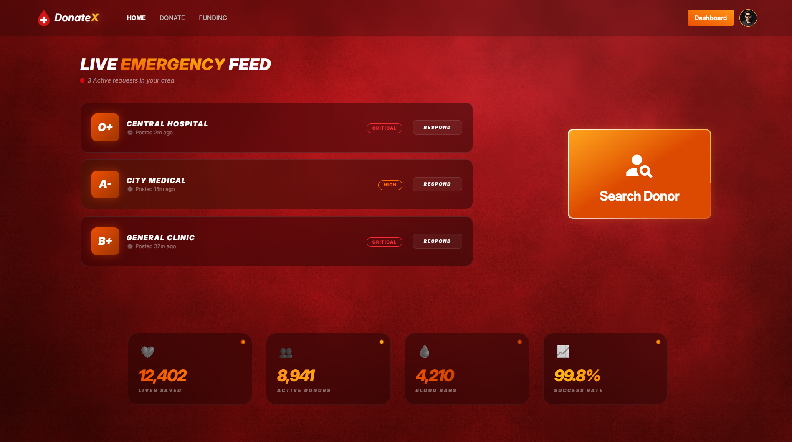

# 🩸 DonateX | Blood Donation & Management System

#### _A high-performance, modern web application built to connect blood donors with recipients. **DonateX** features a robust admin command center, real-time donation tracking, and a seamless search experience for life-saving resources._

### [🚀 View Live Demo](https://kawsar-hussain-ph-assignment-11.netlify.app/)

## 🌟 Key Features

- **🔍 Precision Search:** Filter potential donors and requests by Blood Group, District, and Upazila.
- **📊 Admin Command Center:** Manage users, track donation statuses, and monitor revenue.
- **🔐 Secure Authentication:** Integrated with Firebase (Email/Password).
- **🩸 Live Donation Feed:** Real-time visibility of urgent blood requests.
- **🎨 Responsive UI/UX:** Tailwind CSS 4.0 and DaisyUI.
- **⚡ Smooth Interactivity:** Powered by Motion for fluid transitions.

---

## 🛠️ Tools & Technologies

## 💻 Frond-End

- ⚛️ **React**
- 🛣️ **React Router**
- 🎨 **Tailwind CSS**
- 🌼 **Daisy UI**
- ⚡ **Vite**
- 🎭 **Motion (Framer Motion)**
- 📦 **Axios**
- 🧪 **React Icons**
- 🚨 **SweetAlert2**
- 🍞 **React Toastify**
- ⏳ **React Spinners**

---

## ⚙️ Back-End

- 🚀 **Vercel**
- 🛠️ **Node.js**
- 📊 **Express.js**
- 🗄️ **MongoDB**

---
